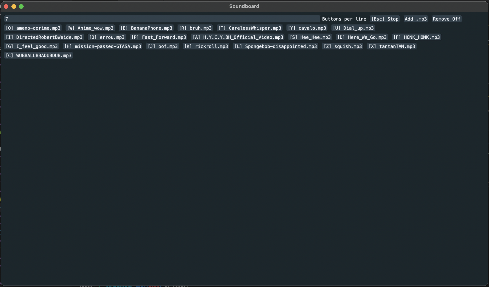

# soundboard [](https://github.com/f01c33/soundboard/actions/workflows/go.yml)
Simple Go soundboard made with giu (imgui)



## Usage
Drag mp3's into the program, click to play. On restart the shortcuts work.

## Install

```bash
go install github.com/f01c33/soundboard@latest
```
or
```bash
git clone https://github.com/f01c33/soundboard.git && cd soundboard
go install .
```
